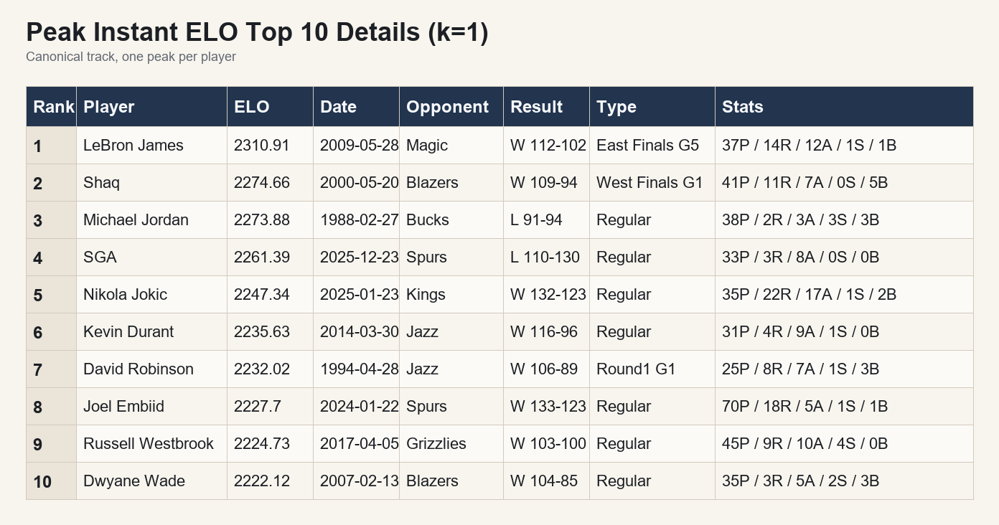
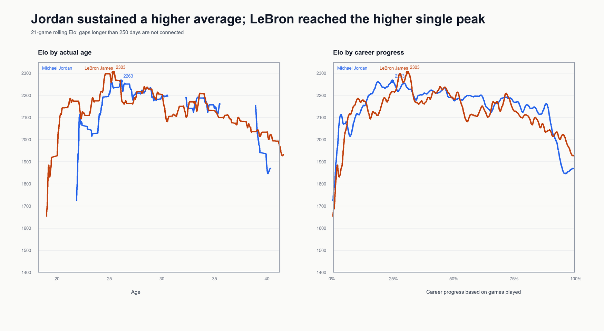
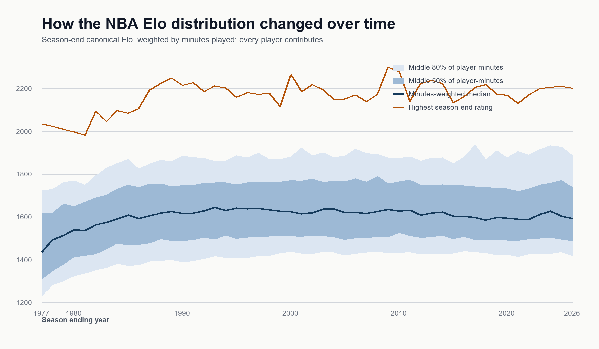

# NBA Dynamic Player Elo

An auditable, game-by-game player rating system for comparing NBA career trajectories and historical peaks from the 1976–77 season onward.

Raw data, databases, video-production material, and player headshots are intentionally excluded from the public source repository.

## 1. Project Overview

Most historical player comparisons collapse a career into one number or compare players only within a single season. This project builds a chronological rating history that supports both longitudinal comparisons across a player's career and contemporaneous comparisons among players active at the same point in history.

The result is a Dynamic Player Elo system driven primarily by individual box-score performance rather than by assigning team wins and losses equally to every player.

## 2. Data

The cleaned research layer contains:

- **58,927 usable NBA games**;
- **1,202,039 usable player-game records**;
- coverage from **1976–77 through 2025–26**;
- regular-season and playoff games;
- traditional box-score statistics, minutes, team, opponent, result, and limited plus/minus fields where historically available.

The pipeline preserves excluded games in an explicit exemption table instead of deleting them. The 382 known exemptions fail a documented completeness or minutes-consistency gate.

Large source files are not stored in the GitHub repository. See [`DATA_MANAGEMENT.md`](DATA_MANAGEMENT.md) for provenance, schemas, validation gates, and reconstruction details.

## 3. Methodology

For every game, the pipeline:

1. computes Hollinger Game Score for each participating player;
2. standardizes performance within the game;
3. weights updates by each player's share of team minutes;
4. applies a higher, decaying update rate to new players;
5. re-centers game-level changes so adjusted updates sum to zero; and
6. advances the league state chronologically before processing the next game.

In simplified form,

```text
raw_delta_i = K_i × minutes_share_i × performance_i
adjusted_delta_i = raw_delta_i − mean(raw_delta for the game)
rating_after_i = rating_before_i + adjusted_delta_i
```

The canonical historical track uses standardized Game Score as the individual-performance signal. A modern comparison track also tests on-court information after reliable plus/minus coverage begins. Full formulas and design decisions are documented in [`ELO_PROJECT_DESIGN.md`](ELO_PROJECT_DESIGN.md).

## 4. Basketball-Specific Design

- **Regular season and playoffs:** both remain on one chronological timeline; playoff influence is tested with explicit multipliers.
- **Rookie initialization:** draft position informs starting ratings, with a floor for undrafted players.
- **Rookie convergence:** the update multiplier decays as games played increases.
- **Minutes and overtime:** player minutes are normalized against team minutes, including overtime.
- **Historical plus/minus gaps:** the canonical track does not depend on plus/minus, which is unreliable or unavailable in early seasons.
- **Cross-season continuity:** ratings carry forward rather than resetting every October.
- **Era scope:** 1976–77 is the first canonical season because earlier player-minute coverage is not sufficiently complete for this model.

## 5. Validation

Model choices were evaluated with chronological holdout seasons, correlation, rank correlation, mean-squared error, bootstrap intervals, and sensitivity grids.

For the selected canonical specification on the recorded holdout task:

- Pearson correlation: **0.862**;
- Spearman correlation: **0.805**;
- MSE: **0.172**, compared with a **0.523** baseline;
- MSE improvement: **0.351**;
- evaluation sample: **1,345 boundaries across 607 players**.

These results validate temporal signal in the rating state; they do not imply that Elo is a complete measure of basketball ability.

## 6. Key Findings and Visualizations

### Peak Elo

LeBron James records the highest canonical instantaneous peak in the current results: **2310.91** on 28 May 2009. Peak results are sensitive to postseason weight and should be interpreted alongside full career paths.



### Career paths are more informative than a single peak

The same model can distinguish peak height, time near the top, decline shape, and return from interruptions. The Jordan–LeBron comparison below is an example of trajectory comparison rather than a one-number verdict.



### The league-wide Elo distribution changes over time

Season-end distributions are not structurally identical across eras. Expansion, player-pool depth, data coverage, and the evolving tail of the distribution all matter when interpreting raw historical levels.



### Live-leaderboard tenure

Thirty-five players reached No. 1 in the canonical live leaderboard. Michael Jordan accumulated the most total calendar time at No. 1 in the current analysis, while LeBron James recorded the longest uninterrupted No. 1 stint and the most total time inside the Top 10.

Supporting tables are in [`results/analysis/4.4_leaderboard_tenure/`](results/analysis/4.4_leaderboard_tenure/).

## 7. Limitations

- The rating is based on recorded box-score information, not tracking data, film, lineup context, or a full latent measure of player ability.
- Game Score encodes a particular valuation of box-score production.
- Cross-era comparisons are affected by league size, player-pool structure, role distribution, pace, and historical data quality.
- A single peak may reward a short exceptional window; career value and durability require separate summaries.
- Ratings are model outputs, not substitutes for historical, tactical, or contextual analysis.
- Recent seasons include a small number of documented data exemptions.

## 8. Repository Structure and Reproduction

```text
src/elo/                 deterministic Elo mathematics and sequential engine
src/fetch/               data-fetching helpers
scripts/                 cleaning, fitting, validation, and analysis entry points
tests/                   unit and pipeline tests
grids/                   parameter-search configurations
results/analysis/        selected tables, notes, and figures
clean_data/              generated research input; not included in the public repo
```

Install the package and development dependencies:

```bash
python -m venv .venv
source .venv/bin/activate        # Windows: .venv\Scripts\activate
python -m pip install -e ".[dev]"
```

Run the test suite:

```bash
python -m pytest
```

Once the documented data files have been reconstructed, the main sequence is:

```bash
python scripts/build_clean_data.py
python scripts/run_final_elo.py
python scripts/build_results_summary.py
```

The full dataset is deliberately distributed separately from the source repository because of size and upstream redistribution constraints.

## 9. Documentation Note

Detailed design decisions and experiment logs are currently maintained in Chinese. This README provides a complete English overview of the project's motivation, methodology, validation, findings, limitations, and repository structure.

## Citation and License

A `CITATION.cff` file and an explicit code license should be added before the repository is made public. NBA marks, player headshots, and third-party data remain the property of their respective rights holders and are not redistributed by default.
